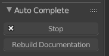

Autocomplete - Unleash the Power of Scripting
^^^^^^^^^^^^^^^^^^^^^^^^^^^^^^^^^^^^^^^^^^^^^

To start the autocomplete function click the button in the left sidebar of the Text Editor. Now this button is replaced with ``Stop`` and ``Rebuild Documentation``. Rebuilding the documentation can be useful if you registered your own properties.

.. image:: start_button.png

If you start typing the autocomplete-box pops up and gives you suggestions. You can accept the selected one by pressing the TAB key or by clicking on it. Most of the time the addon notices when the autocomplete-box needs to be open. If you want to open/close it manually, just hit the ALT key.

Templates
*********

The addon comes with a few static templates which are shown if you typed specific patterns.
Here is a list with the currently available patterns with call templates:

**New Panel**::

    class YourClassName(bpy.types.Panel):
    class YourClassName(Panel):

**New Operator**::

    class YourClassName(bpy.types.Operator):
    class YourClassName(Operator):
1. normal operator
2. modal operator
3. modal operator with draw  

**New Menu**::

    class YourClassName(bpy.types.Menu):
    class YourClassName(Menu):
1. normal menu
2. pie menu

**Register**::

    def register():

**Addon Info**::

    bl_info = 
    
**License Header**::

    '''
    
    
Dynamic Snippets
****************

These snippets are also triggered by specific patterns you write.

**Class Header**

| ``=p|myClass`` -> ``class myClass(bpy.types.Panel)``
| ``=p|panel`` -> ``class panel(bpy.types.Panel)``
| ``=m|myMenu`` -> ``class myMeny(bpy.types.Menu)``
| ``=o|Test`` -> ``class Text(bpy.types.Operator)``

**Setup Keymap**

If you write somewhere in your script ``=keymaps``, you generate a basic setup for creating custom keybindings. Be sure that you already have a register function. This dynamic snippet searches for ``bpy.utils.register_module(__name__)`` and ``bpy.utils.unregister_module(__name__)``.

**New Keybinding**

| ``=key|h`` -> ``kmi = km.keymap_items.new("transform.translate", type = "H", value = "PRESS")`` 
| ``=key|m`` -> ``kmi = km.keymap_items.new("transform.translate", type = "M", value = "PRESS")``
| ``=key|n|shift`` -> ``kmi = km.keymap_items.new("transform.translate", type = "N", value = "PRESS", shift = True)``
| ``=key|k|alt|shift|ctrl`` -> ``kmi = km.keymap_items.new("transform.translate", type = "K", value = "PRESS", ctrl = True, shift = True, alt = True)``

You can also choose between calling a operator, menu or pie menu from the autocomplete-box.

Other things
************

By pressing ``ctrl Y`` you can select a whole string. I found that useful when replacing descriptions. Just put the cursor inside, press both keys and start typing.